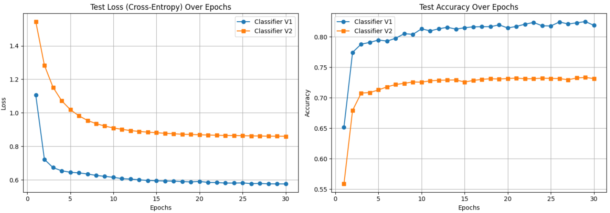

# Autoencoders, MLP, and Regression

This repository contains implementations of foundational deep learning architectures using PyTorch. It explores dimensionality reduction and feature extraction via Autoencoders, complex non-linear regression using Multi-Layer Perceptrons (MLPs), and theoretical mathematical derivations for MADALINE networks.

## 1. Dimensionality Reduction & Classification using Autoencoders

- Implemented and trained two Autoencoder architectures with varying bottleneck dimensions on the MNIST dataset, followed by a classifier trained on the frozen latent features.
    

### ⚙️ Methodology

- **Data Processing:** Normalized MNIST image pixel values to a $[0, 1]$ range and flattened the 2D $28 \times 28$ matrices into 784-dimensional vectors.
    
- **Architecture (Autoencoder):** Constructed a feedforward Autoencoder with a hidden layer of 128 neurons and a highly constrained bottleneck (latent space) of either $8$ dimensions (Model V1) or $4$ dimensions (Model V2).
    
- **Architecture (Classifier):** Attached a custom Multi-Layer Perceptron (e.g., $8 \rightarrow 4 \rightarrow 10$) to the frozen encoder. This network mapped the compressed latent representations ($z$) to the 10 digit classes using ReLU activations.

### Results

The Autoencoders successfully learned to compress and reconstruct the images, while the classifiers proved that the latent space retained crucial structural information.

- **Quantitative Evaluation:** The V1 classifier (8D latent space) achieved an accuracy of **`~82.5%`**, while the V2 classifier (4D latent space) achieved **`~73.3%`**. This explicitly demonstrates the trade-off and impact of bottleneck size on feature retention and classification capability.

## 2. Life Expectancy Prediction using MLP Regression

- Developed a robust regression pipeline to predict life expectancy based on the WHO (World Health Organization) dataset using deep Multi-Layer Perceptrons.
    

### ⚙️ Methodology

- **Data Processing:** Handled missing values via mean imputation and removed statistical outliers using Z-score filtering ($Z \ge 3.0$). Applied `StandardScaler` to standardize both the input features ($X$) and the target variable ($y$) to ensure stable gradient updates ($\mu=0, \sigma=1$).
    
- **Architecture:** Designed three MLP variants. The baseline models utilized 1 to 2 hidden layers. The **Advanced Model** utilized a deeper architecture ($64 \rightarrow 32 \rightarrow 8$) integrated with **Batch Normalization** and layer-specific **Dropout** ($0.2$ to $0.8$ decay) to prevent overfitting.
    
- **Optimization:** Trained the networks to minimize the Mean Squared Error (MSE) loss using the Adam optimizer (learning rate = $0.0001$) over 200 epochs.
    

### Results

The Advanced Model significantly outperformed the shallower baselines by successfully capturing complex non-linear relationships across various health and economic indicators.

- **Quantitative Evaluation (Advanced Model):** 
	- **MSE:** `$10.5086$`
    
    - **RMSE:** `$3.2417$`
        
    - **R² Score:** **`0.8872`**. This high $R^2$ score confirms that the model successfully explains ~88.7% of the variance in life expectancy across different countries.
