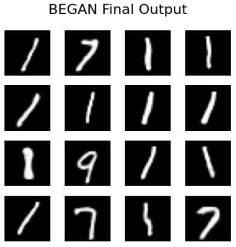
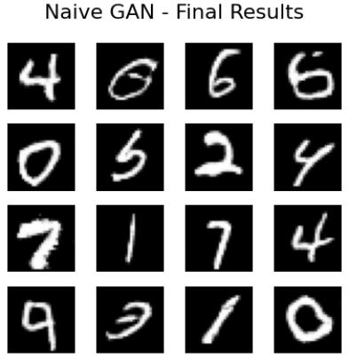
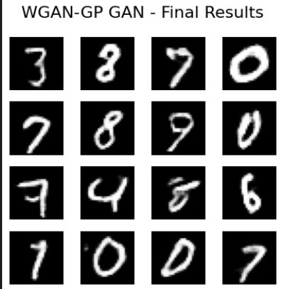

# Image Generation Using Naive GAN, WGAN-GP & BEGAN

This repository explores Generative Adversarial Networks (GANs) for image synthesis. It implements Naive GAN (DCGAN), WGAN-GP, and BEGAN architectures to generate digits from the MNIST dataset, and provides an empirical and mathematical analysis of training stability, Wasserstein distance, and the mode collapse phenomenon.

## 1. Generative Architectures & Image Synthesis

- Implemented Naive GAN, WGAN-GP, and BEGAN architectures and trained them on the MNIST dataset to approximate the true data distribution.

### ⚙️ Methodology

- **Data Processing:** Utilized the standard MNIST dataset, normalizing pixel values to the `[-1, 1]` range to align with the Generator's `Tanh` output activation function. The mini-batch size was set to 64.
- **Naive GAN (DCGAN):** Constructed a Deep Convolutional GAN using `ConvTranspose2d` for upsampling and `BatchNorm2d` in the Generator. The Discriminator utilized `Conv2d`, `Leaky ReLU`, and a `Sigmoid` output. Optimized using Binary Cross-Entropy (`BCELoss`) with the non-saturating loss trick to mitigate vanishing gradients.
- **WGAN-GP:** Modified the standard discriminator into a Critic (removing the `Sigmoid` activation) to output a real-valued scalar estimating the Wasserstein distance. Replaced Batch Normalization with `LayerNorm` in the Critic to allow for independent gradient calculations required by the Gradient Penalty.
- **BEGAN:** Replaced the standard discriminator with an Autoencoder structure utilizing an Encoder-Decoder architecture and `ELU` activations. Trained using a pixel-wise `L1Loss` reconstruction error.

### Results

The models demonstrated varying degrees of success in generating realistic MNIST digits, highlighting the distinct trade-offs between training stability, image quality, and sample diversity.

- **Quantitative Evaluation (FID Score):**
    - **Naive GAN:** `5.9782`
    - **WGAN-GP:** `9.5857`
    - **BEGAN:** `58.0975`

All models were trained on 30 epochs and Naive GAN performed best but we should keep in mind that n_critic was set to 2 for WGAN-GP meaning the generator updates about half the times of Naive GAN.

- **Loss Convergence & Stability:**
    - **Naive GAN:** Exhibited extreme loss spikes and gradient instability. Loss values provided no intuitive meaning regarding actual generated image quality.
    - **WGAN-GP:** Demonstrated highly stable and smooth loss curves, completely eliminating the extreme spikes seen in the Naive approach.

- **Mode Collapse Diagnostics:**
    - **BEGAN:** Despite producing the sharpest individual images, the model suffered from severe mode collapse. To satisfy the strict equilibrium constraints, the Autoencoder entirely sacrificed diversity, exclusively generating simple linear digits like `1`, `7`, and `9` that posed the lowest risk of L1 reconstruction error. This catastrophic drop in diversity mathematically triggered the heavily penalized FID score of `58.0975`.
