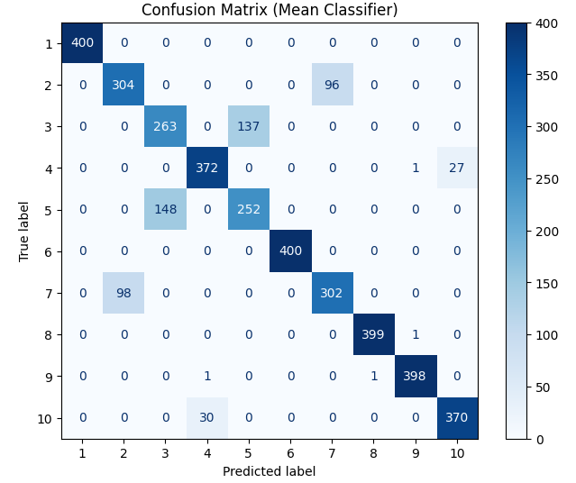
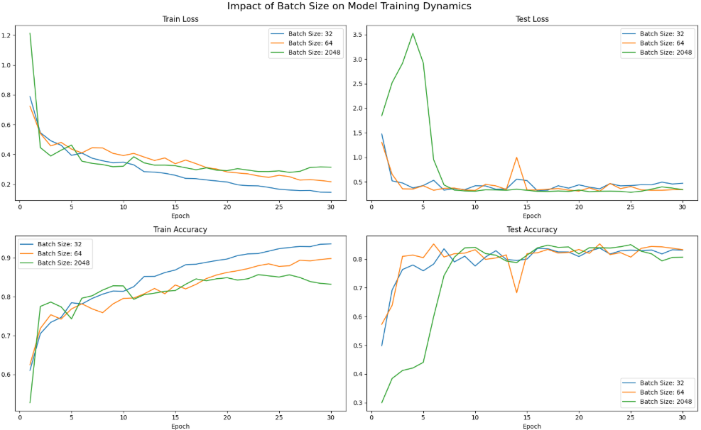
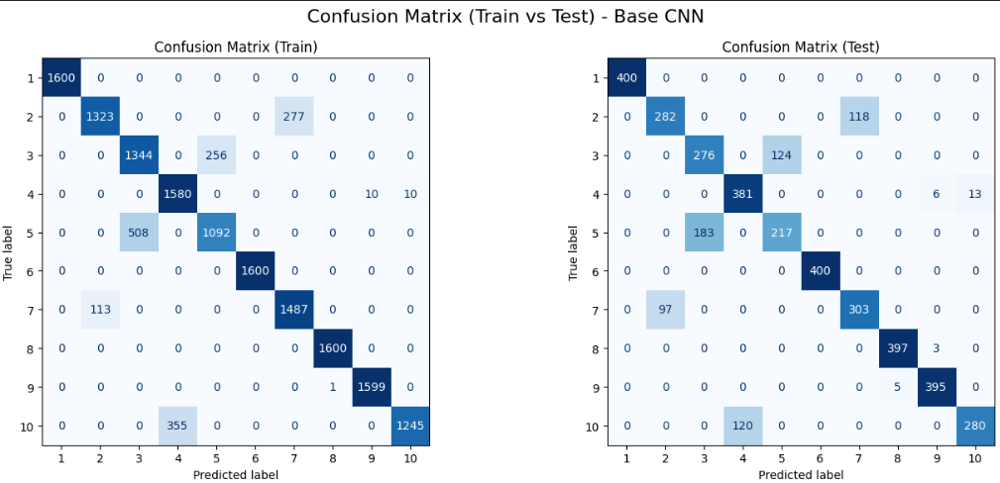
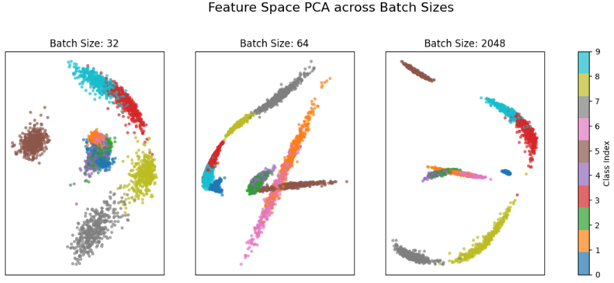
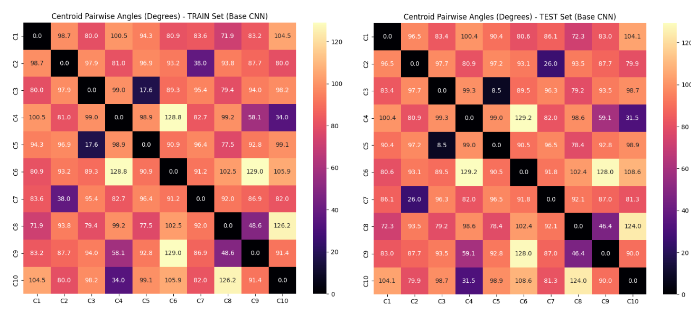
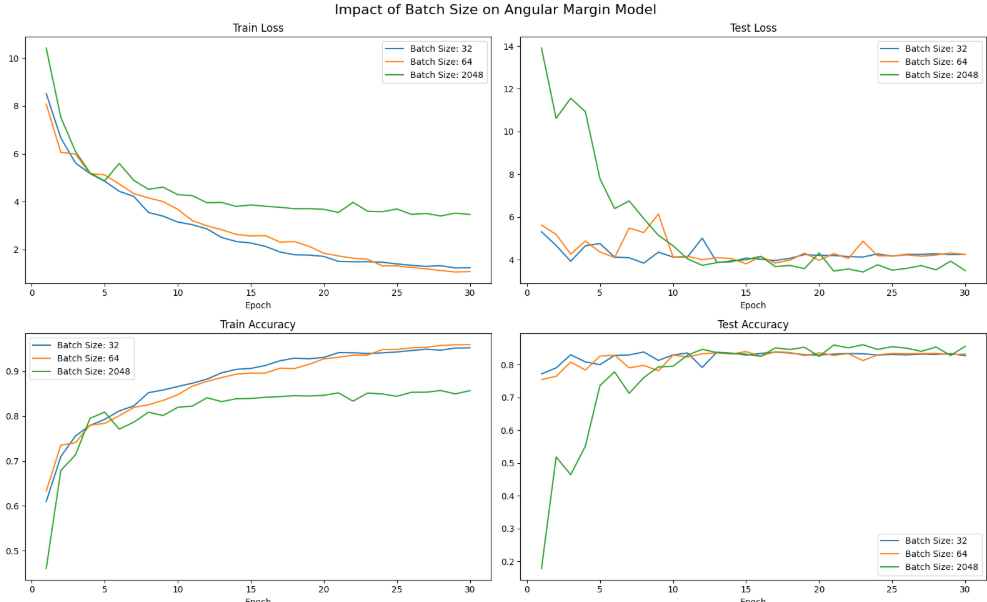
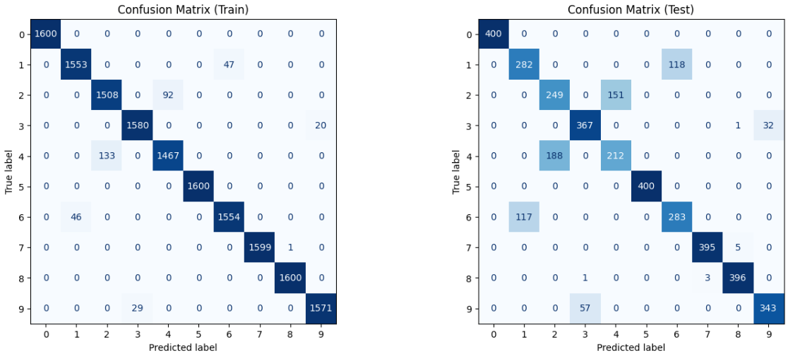
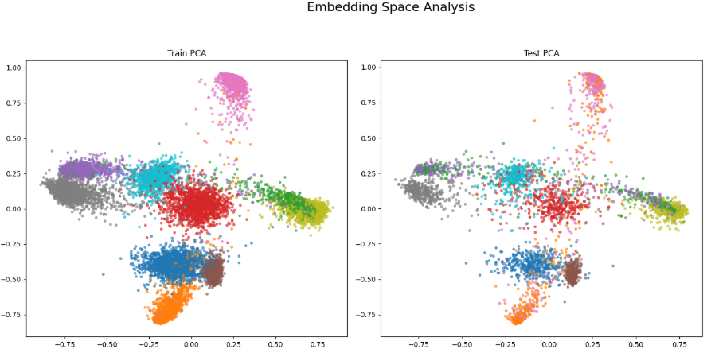
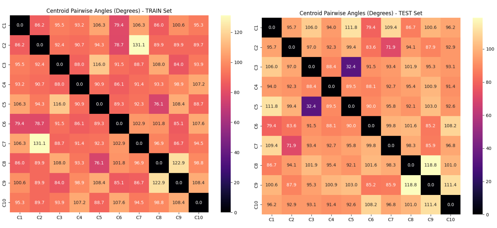

# Face Recognition - Inter-class Angular Margin Loss & CNNs

This repository explores the implementation and mathematical foundations of advanced loss functions for face recognition. It compares a standard Convolutional Neural Network (CNN) trained with Softmax Cross-Entropy against an identical architecture optimized with an Angular Margin Loss on a custom-generated dataset to analyze inter-class variance and intra-class compactness.

## 1. Data Synthesis & Mean Classifier Baseline

- Generated a synthetic toy dataset to simulate 10 distinct "face" classes with inherent statistical overlap, testing the limits of decision boundaries.
    

### ⚙️ Methodology

- **Data Generation:** Created 20,000 samples of 14x14 pixel images. Pixel values for each class were drawn from a normal distribution with a randomly assigned class mean (between -5.0 and 5.0) and a fixed variance of 1.5.
    
- **Statistical Verification:** Calculated the covariance matrix of the class centroids, verifying theoretical independence. The diagonal matched the expected variance $\frac{\sigma^2}{N} = 0.00075$, while off-diagonals were strictly zero.
    
- **Baseline Model:** Implemented a Nearest Centroid (Mean) Classifier using Euclidean distance.
    

### Results

The Mean Classifier achieved an initial test accuracy of **86.5%**. However, analysis of the Confusion Matrix revealed targeted misclassifications between specific hard class pairs (e.g., classes 3 and 5) that had randomly spawned with proximate centroids, causing severe spatial overlap.

## 2. Base CNN with Softmax Classification

- Trained a Deep Convolutional Neural Network (inspired by the MNIST network) to extract 128-dimensional embeddings, classified via a standard Softmax head.
    

### ⚙️ Methodology

- **Architecture:** Constructed 3 feature-extraction blocks comprising `Conv2d`, `BatchNorm2d`, `ReLU`, and `MaxPool2d` layers. The flattened features were passed through a dense layer to create a 128D embedding space, ending in a 10-neuron classification head. Total trainable parameters: **354,282**.
    
- **Optimization:** Trained using standard `CrossEntropyLoss` and the Adam optimizer. Applied a `ReduceLROnPlateau` scheduler to ensure smooth convergence over 30 epochs.
    

### Results

The model converged best with a batch size of 64, achieving a test accuracy of **83.28%**.

- **Feature Space Geometry:** PCA visualization demonstrated a distinct radial (spoke-like) distribution. This confirms that Softmax increases prediction confidence by scaling the magnitude of the embedding vectors but applies no constraint to the angular separation.
    
- **Class Separation:** The pairwise centroid angle heatmap revealed severely acute angles (as low as 8.5°) between overlapping classes, leading to fragile decision boundaries for hard samples.

## 3. Angular Margin Loss for Enhanced Feature Extraction

- Modified the objective function to explicitly maximize inter-class variance and stabilize feature representation by constraining embeddings to a hypersphere.
    

### ⚙️ Methodology

- **L2 Normalization:** Eliminated magnitude-based network "cheating" by applying L2 normalization to both the embedding vectors ($x$) and the classifier weights ($w$). By enforcing $||w||=1$ and $||x||=1$, the network output (logits) strictly equals the cosine similarity: $w^T x = \cos(\theta)$.
    
- **Angular Margin:** Subtracted a fixed angular margin penalty ($m = 0.35$) directly from the target class logit: $\hat{y} = \cos(\theta_y) - m$.
    
- **Loss Calculation:** Scaled the penalized logits by a hyperparameter $s$ to ensure stable gradients before applying Cross-Entropy Loss.
    

### Results

While the raw test accuracy remained comparable (**83.17%**) due to the dataset's inherent, inescapable statistical overlap, the underlying feature geometry was vastly superior.

- **Angular Expansion:** The critical overlap angle between the hardest classes (e.g., classes 3 and 5) expanded drastically from 8.5° in the baseline to **32.4°**. Most inter-class angles were successfully pushed into a robust 90°–110° range.
    
- **Hypersphere Projection:** PCA confirmed that embeddings formed distinct, dense arcs on the surface of a unit hypersphere, proving the margin penalty successfully pushed apart competing classes.

## 4. Quantitative Comparative Analysis

A direct evaluation in the 128D embedding space confirms the theoretical goals of the Angular Margin approach:

|**Metric**|**Softmax CNN (Train)**|**Softmax CNN (Test)**|**Angular Margin CNN (Train)**|**Angular Margin CNN (Test)**|
|---|---|---|---|---|
|**Accuracy**|89.83%|83.28%|95.94%|83.17%|
|**Macro Precision**|0.9102|0.8383|0.9771|0.8322|
|**Macro Recall**|0.9044|0.8328|0.9770|0.8318|
|**Mean Inter-class Distance**|1.3653|1.3557|1.4750|**1.4551**|
|**Mean Intra-class Distance**|0.1588|0.1840|0.2535|0.5040|

The increased **Mean Inter-class Distance** confirms the Angular Margin function forces classes away from each other. The increase in intra-class distance is a geometric side-effect of highly noisy data being stretched along the hypersphere arcs to escape incorrect class boundaries. Ultimately, the Angular Margin builds a highly discriminative latent space vital for real-world tasks like unseen Face ID verification.
