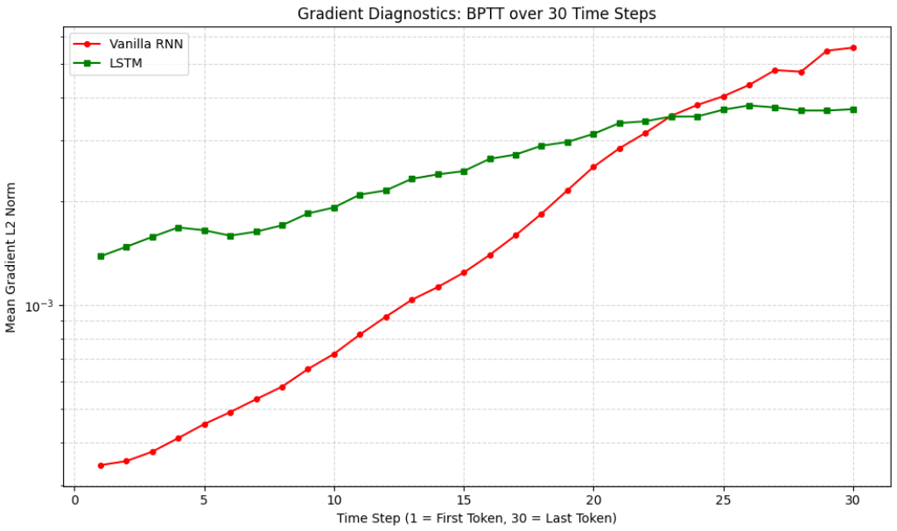

# Sentiment Analysis Using Vanilla RNN, LSTM & GRU

This repository explores Deep Recurrent Neural Networks for sequence processing. It implements Vanilla RNN, LSTM, and GRU models to perform sentiment analysis on movie reviews, and provides an empirical and mathematical analysis of gradient flow (BPTT) and the vanishing gradient problem.

## 1. Sentiment Analysis & Model Comparison

- Implemented Vanilla RNN, LSTM, and GRU architectures and trained them on a binary movie review sentiment dataset.
    

### ⚙️ Methodology

- **Data Processing:** Tokenized raw text from positive and negative movie reviews and built a custom vocabulary class (`TokenToID`) restricting features to the top 5000 most frequent tokens. Utilized a custom `collate_fn` to dynamically pad variable-length sequences within each batch to optimize GPU computation.
    
- **Architecture:** Constructed a modular `SentimentRNN` class comprising an Embedding layer (64D), the core recurrent unit (RNN, LSTM, or GRU with 128 hidden dimensions), and a fully connected linear classification head.
    
- **Optimization:** Models were trained using the Adam optimizer and Binary Cross-Entropy with Logits Loss (`BCEWithLogitsLoss`) over 5 epochs.
    

### Results

The recurrent models successfully learned to classify the sentiment of movie reviews. The GRU model outperformed the others, demonstrating superior capability and efficiency in capturing semantic dependencies.

- **Quantitative Evaluation (Test Accuracy):**
    
    - **Vanilla RNN:** `65.86%`
        
    - **LSTM:** `66.00%`
        
    - **GRU:** `70.10%` _(Best Performance)_
        

## 2. Gradient Diagnostics & BPTT Analysis

- Conducted a spectral and empirical analysis of Backpropagation Through Time (BPTT) to evaluate the vanishing and exploding gradient phenomena across different architectures.
    

### ⚙️ Methodology

- **Theoretical Proofs:** Mathematically derived the temporal Jacobian matrices and proved that the spectral norm of the recurrent weight matrix bounds the gradient norm. Demonstrated how LSTM and GRU additive updates bypass the multiplicative vanishing effects of standard RNNs.
    
- **Empirical Tracking:** Tracked and plotted the mean L2 norm of the gradients as they propagated backwards from the last token (Step 30) to the first token (Step 1) during training.
    

### Results

The empirical results perfectly aligned with the theoretical derivations, illustrating the severe vanishing gradient in Vanilla RNNs and the stability of LSTMs.

- **Gradient Retention (Ratio of Step 1 / Step 30):**
    
    - **Vanilla RNN:** `0.0617` (Severe signal loss, retaining only ~6% of the gradient magnitude by the first step).
        
    - **LSTM:** `0.3750` (Stable gradient flow).
        
- The Constant Error Carousel (CEC) and forget gates in the LSTM successfully prevented the exponential decay of gradients. The LSTM gradient curve remained vastly more stable than the RNN, allowing the network to successfully update weights based on long-term dependencies.
